# 🛡️ C&D Sentinel: Multimodal Content Moderation System

**C&D Sentinel** is an intelligent, multimodal content moderation pipeline designed to detect toxic, hateful, and unsafe content across **Text, Images, and Video**.

Unlike traditional "black box" classifiers that struggle with context (e.g., banning gamers for saying "kill the boss"), C&D Sentinel uses a **Hybrid Two-Stage Architecture**. It combines lightweight, real-time models (DistilBERT, BLIP) with the reasoning power of Large Language Models (Llama-3 via Groq) to distinguish between malicious hate speech and safe context like gaming, satire, or song lyrics.

you can view the site at: https://cd-sentinel.streamlit.app/

---

## 🚀 Key Features

### 1. 📝 Intelligent Text Analysis
* **Hybrid Pipeline:** Uses a fast "Stage A" filter for obvious toxicity and a "Stage B" LLM for ambiguous cases.
* **Context Awareness:** Automatically detects **Gaming Slang**, **Satire**, and **Pop Culture** references to prevent false positives.
* **Severe Toxicity Override:** Implements a "Zero Tolerance" bypass for direct threats ($>0.97$ confidence), ensuring dangerous content is never excused by context.
* **Batching Engine:** Handles long-form content (documents, transcripts) using a sliding window approach, ensuring no toxic threats are hidden at the end of a file.

### 2. 👁️ Computer Vision (Image Moderation)
* **Generative Captioning:** Uses **Salesforce BLIP** (Bootstrapping Language-Image Pre-training) to describe images in natural language.
* **Semantic Reasoning:** Instead of relying on simple visual tags (like "gun" = bad), it analyzes the *scene* (e.g., "a soldier in a movie scene" vs. "a person threatening with a knife").

### 3. 🎬 Multimodal Video Audit
* **Dual-Stream Processing:** Analyzes both **Visual Frames** (Eyes) and **Audio Tracks** (Ears) simultaneously.
* **Frame Sampling:** Extracts and analyzes 1 frame every 2 seconds for efficiency.
* **Audio Transcription:** Uses **Groq Whisper-Large-v3-Turbo** for near-instant speech-to-text conversion.
* **Aggregation Logic:** Uses strictly logical `OR` gates—if *either* the visual stream OR the audio stream is toxic, the video is flagged.

---

## 📊 Performance & Benchmarks

We evaluated the system against industry-standard datasets, including the **Facebook Hateful Memes Challenge**.

| Metric | Model / Method | Result | Insight |
| :--- | :--- | :--- | :--- |
| **Accuracy** | **C&D Sentinel (BLIP + Pipeline)** | **90.00%** | Successfully understood context (e.g., separating pets from violence). |
| Accuracy | Zero-Shot CLIP (Baseline) | 14.00% | Failed significantly; flagged safe images (like cats) as "Violence" due to color bias. |
| **Latency** | Groq LPU Inference | **< 200ms** | Near real-time responses for text and audio. |
| **Robustness** | Audio Transcription | **100%** | Handled 20+ minute videos using dynamic batching without crashing. |

---

## 🛠️ System Architecture

The system follows a "Funnel" architecture where all inputs (pixels, sound waves) are converted into text and processed by a central logic engine.

```mermaid
graph TD
    User[User Input] --> Split{Media Type?}
    
    %% PATHS
    Split -- Text --> Logic
    
    Split -- Image --> BLIP[BLIP Model]
    BLIP -- Caption --> Logic
    
    Split -- Video --> AV[Split Audio/Visual]
    AV -- Frames --> BLIP
    AV -- Audio --> Whisper[Groq Whisper]
    Whisper -- Transcript --> Logic
    
    %% CORE LOGIC
    subgraph Logic [Central Moderation Engine]
        StageA[Stage A: DistilBERT] --> Check{Score > 0.97?}
        Check -- Yes --> Block[❌ BLOCK]
        Check -- No --> Context[Sentiment + Keywords]
        Context --> Gate{Ambiguous?}
        Gate -- Yes --> LLM[Stage B: Llama-3-70b]
        Gate -- No --> Result[Safe/Unsafe]
    end
```


💻 Installation & Setup
-----------------------

### Prerequisites

-   Python 3.10+

-   A free **Groq API Key** (for LLM & Whisper support)

-   [Optional] NVIDIA GPU (Recommended for faster local inference)

### 1\. Clone the Repository

Bash

```
git clone [https://github.com/AdmiralC007/CandD-Sentinel.git](https://github.com/AdmiralC007/CandD-Sentinel.git)
cd CandD-Sentinel

```

### 2\. Install Dependencies

Bash

```
# Install Python libraries
pip install -r requirements.txt

# Install system packages (Linux/Mac only - Windows usually auto-handles this)
# xargs -a packages.txt sudo apt-get install

```

### 3\. Set Up Environment Secrets

Create a file named `.env` in the root directory and add your Groq API key:

Ini, TOML

```
GROQ_API_KEY=gsk_your_actual_key_here_123456789

```

* * * * *

🚀 Usage
--------

### Option 1: Run the Web UI (Recommended)

We use **Streamlit** for a sophisticated, dark-mode interface.

Bash

```
streamlit run app.py

```

-   Opens in your browser at `http://localhost:8501`

-   Supports drag-and-drop for Images and Videos.

### Option 2: CLI Tools (For testing/debugging)

You can run individual modules directly from the terminal:

-   **Text Analysis:**

    Bash

    ```
    python src/text_moderation.py

    ```

-   **Video Analysis:**

    Bash

    ```
    python src/video_moderation.py

    ```

* * * * *

📂 Project Structure
--------------------

Plaintext

```
CandD-Sentinel/
├── app.py                  # Main Streamlit Web Application
├── requirements.txt        # Python dependencies
├── packages.txt            # System dependencies (ffmpeg)
├── .env                    # API Keys (Excluded from Git)
├── models/                 # Local model weights (Excluded from Git)
│
├── src/                    # Source Code
│   ├── text_moderation.py  # Core Logic: Pipeline, Batching, LLM calls
│   ├── image_moderation.py # BLIP integration for Image Captioning
│   ├── video_moderation.py # Frame extraction & Whisper Audio integration
│   └── evaluate_images.py  # Benchmarking script for Hateful Memes
│
└── data/                   # Dataset storage (Excluded from Git)

```

* * * * *

🔮 Future Scope
---------------

1.  **Live Stream Moderation:** Adapt the video pipeline to process RTMP streams in real-time.

2.  **User Reputation Scores:** Track repeat offenders to adjust threshold sensitivity dynamically.

3.  **Custom LLM Fine-Tuning:** Fine-tune Llama-3 on policy-specific guidelines for even higher accuracy.

* * * * *

👥 Contributors
---------------

-   **M Chaitanya** 

-   **V Darpad Sai** 

**All Rights Reserved © 2025**
